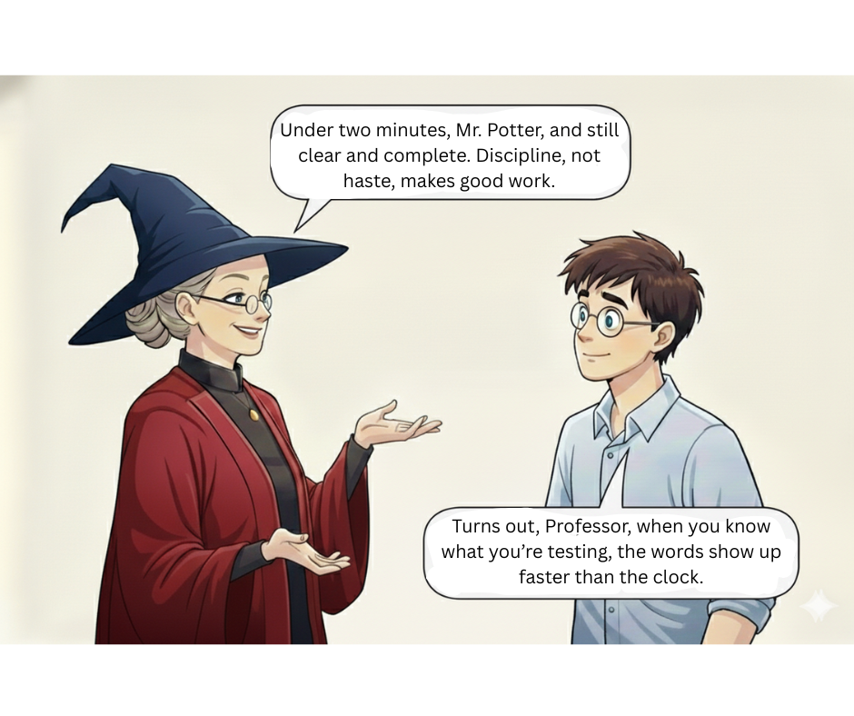

```md
# Day 10 of #28DaysOfTesting

I want a number from you today.

Pick any feature. Something from your current project, or the Potion Shop site from Day 3 (link in the comments).

Set a timer. Write two solid test cases from scratch. Or test charters. Or Gherkin scenarios. Use whatever format you actually use at work. The kind you would submit with confidence, not rough notes you would want to clean up later.

Start the timer when you begin thinking.  
Stop it when you are done.

Share your number and the format you went with.
```


