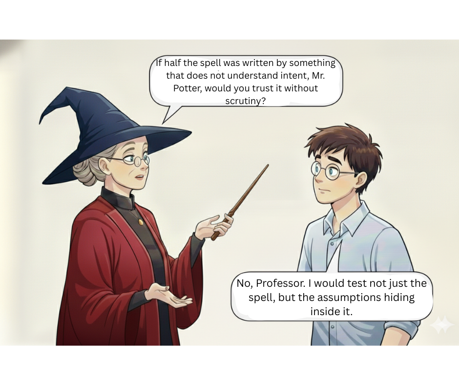

```md
# Day 12 of #28DaysOfTesting

One question. Takes three minutes.

Walk over to a developer. Or message them. Whatever works. Ask:

"What are you most worried about in the feature you are building right now?"

A lot of us never ask this. I did not for years. It felt like overstepping. Like I was supposed to figure everything out on my own.

Then I started asking. And the answers changed how I tested.

"I am not sure the error handling works when the API times out."  
"The migration script has not been tested with real data volumes."  
"Honestly? I wrote that part at 2 am and barely remember what I did."

Every single answer pointed me somewhere I would not have looked. Developers know where the weak spots are. They just do not always speak about them unless you ask.

---



