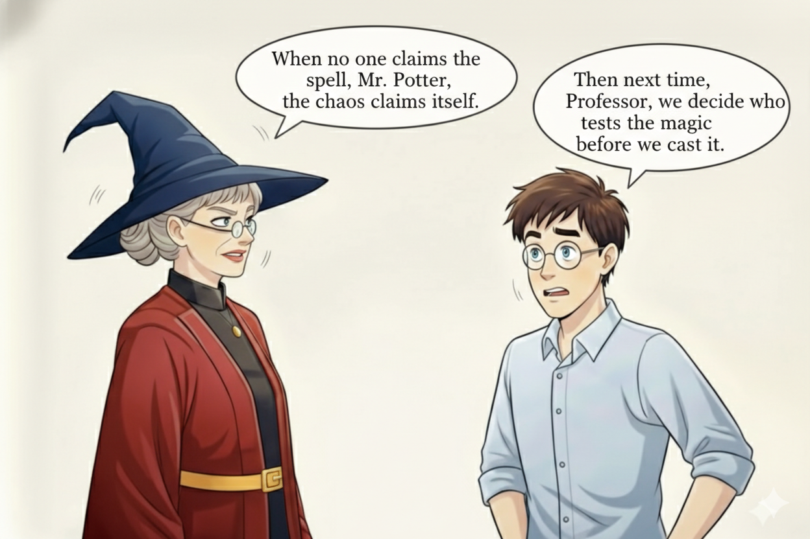

# Day 13 of #28DaysOfTesting

"I thought YOU tested that."

Five words that can sink a release.

We have all been in that meeting. Something breaks in production. Everyone looks around the table. Nobody owns it because nobody clearly agreed who would.

The handoff problem is not really about blame. It is about assumptions. Somewhere between "dev complete" and "ready for release," testing quietly becomes everyone’s job and no one’s responsibility at the same time.

Today’s challenge: share your worst "I thought YOU tested that" moment. What broke? Who got blamed? And more importantly, what changed after?

The painful stories often teach us the most.

