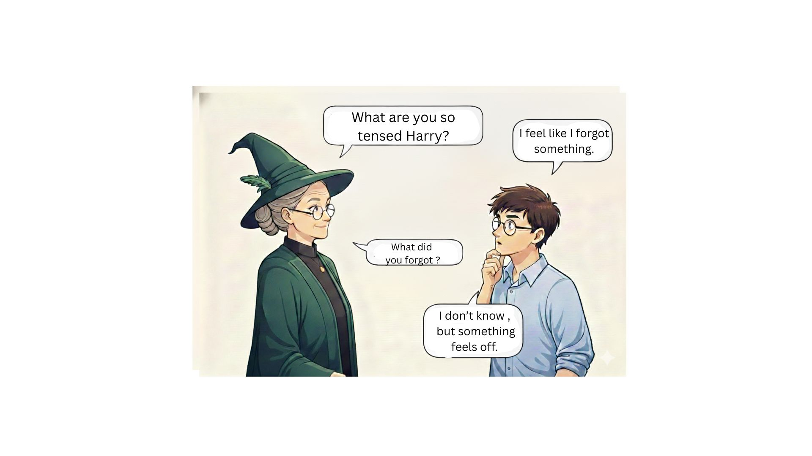

# Day 6 – #28DaysOfTesting

Yesterday was about curiosity saving releases.  
The extra test.  
The gut check.  
Trusting your instincts.

Today is about what happens **after** there are no more tests to run.

The release is out.  
The pipeline is green.  
Your test cases have passed.

And yet… you still can’t close your laptop.

You’re scanning logs.  
Refreshing dashboards.  
Maybe even checking production in your pyjamas before breakfast  
(thanks Sara Åkerlindh for sharing that feeling).

That post-release anxiety?  
It never fully goes away.  
Not after 2 years.  
Not after 18.

## Today’s Challenge

Describe a time when you shipped something and had that  
**“What did I miss?”** feeling.

What happened next?  
- A bug in production?  
- Or worry for nothing?

---

