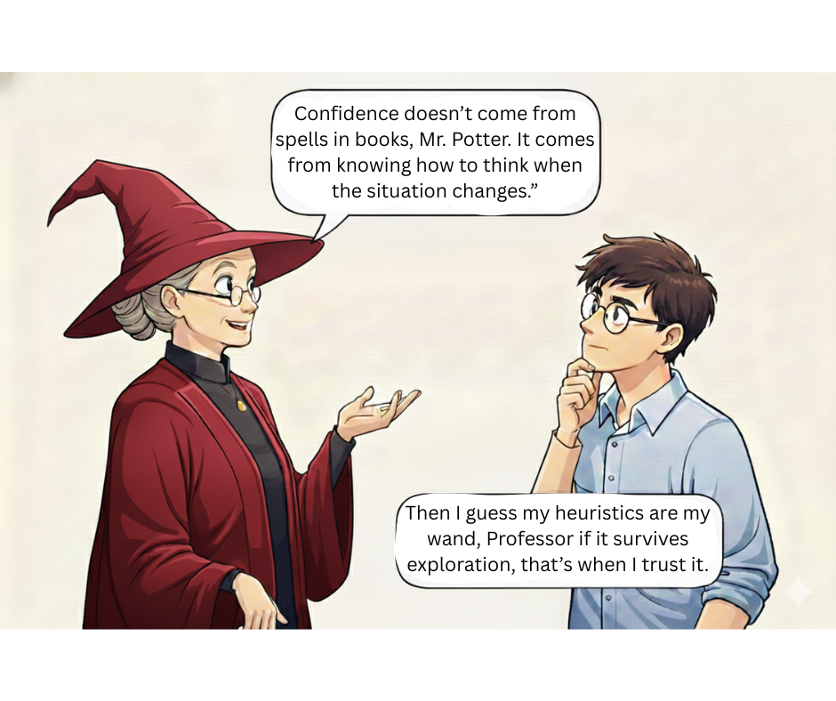

# Day 7 of #28DaysOfTesting

We’ve covered a lot this week.

Blank pages.  
Second-guessing.  
Bug reports.  
That nagging feeling after release.

Here’s what I really want to know:

**What actually helps?**

Not advice from books.  
Not best practices.

The *real* thing that makes you test with more confidence.

Maybe it’s a checklist you trust.  
Maybe it’s a person who gets it.  
Maybe it’s something completely different.

Share the one thing that works for you.

#ConfidentTesting

