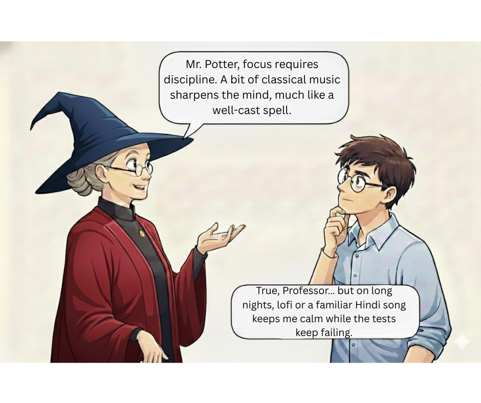

## Day 8 of #28DaysOfTesting

Weekend question  
What’s your testing soundtrack?

Music  
Podcasts  
Complete silence  
Or the distant sound of builds failing 👀

For me, it’s either classical music or electronic.  
It depends on the work.

If I need deep focus, classical helps me think clearly.  
If I need energy, electronic keeps me moving.

What keeps you in the zone?

